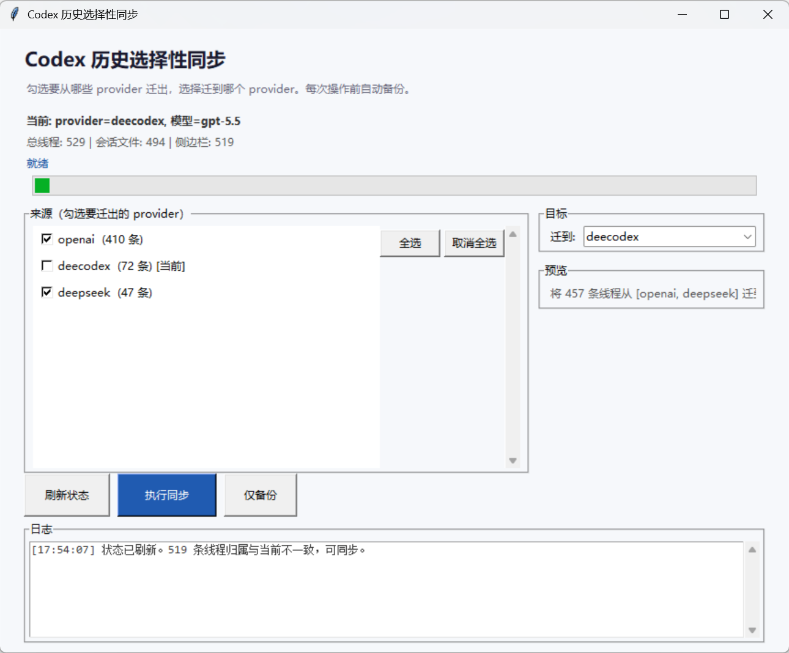

# Codex History Sync Tool

> 基于 [GODGOD126/codex-history-sync-tool](https://github.com/GODGOD126/codex-history-sync-tool)（MIT 许可）二次开发。

Codex Desktop 切换 API、provider、模型或登录方式后，本地聊天历史有时会从侧边栏消失。这个工具扫描本机数据库和会话文件，把旧线程重新关联到你当前的配置下。

## 界面预览

## 下载使用

从 [Releases](https://github.com/Rosa134/codex-history-sync-tool/releases) 下载 CodexSyncTool.exe，双击运行。

> **使用前提**：本机必须安装过 Codex Desktop 并产生过聊天记录（本地数据目录 %USERPROFILE%\.codex 存在）。工具不联网，只操作本地文件。

## 功能

1. 打开后自动加载当前状态——每个 provider 下有多少条历史线程
2. 勾选要从哪些来源 provider 迁出（当前使用的默认不勾选）
3. 选择目标 provider
4. 预览区显示迁移数量
5. 点击「执行同步」：自动备份 → 更新数据库 → 更新会话文件 → 重建侧边栏索引
6. 「仅备份」按钮可单独创建数据库备份
7. 「刷新状态」按钮重新加载最新数据

## 命令行

`ash
# 查看状态
python sync_backend.py status

# 全量同步
python sync_backend.py sync

# 选择性同步
python sync_backend.py selective-sync --target-provider openai --source-providers deepseek,myproxy

# 备份 / 恢复
python sync_backend.py backup
python sync_backend.py restore --backup <路径>
`

## 从源码构建 EXE

需要完整版 Python 3.11+（非 embeddable），且安装了 tkinter 支持：

`ash
pip install pyinstaller
pyinstaller --onefile --windowed --name CodexSyncTool --add-data "sync_backend.py;." sync_ui.py
`

产物在 dist/CodexSyncTool.exe。

## 技术说明

- 操作前自动备份 state_5.sqlite 到 .codex/history_sync_backups/
- 更新数据库 model_provider 和 model 字段
- 同步更新会话 JSONL 文件首行元数据
- 重建侧边栏索引 session_index.jsonl
- WAL 模式等待锁，Codex Desktop 运行中也能安全操作

## 项目文件

| 文件 | 说明 |
|------|------|
| sync_backend.py | 核心逻辑：数据库读写、会话同步、索引重建 |
| sync_ui.py | tkinter 中文图形界面 |
| sync_web_ui.py | Web 界面（实验性） |
| launch_ui.ps1 | PowerShell 启动脚本 |
| 	ests/ | 单元测试 |

## 许可

MIT License — 详见 [LICENSE](LICENSE)。原版 [GODGOD126/codex-history-sync-tool](https://github.com/GODGOD126/codex-history-sync-tool) 同为 MIT 许可。